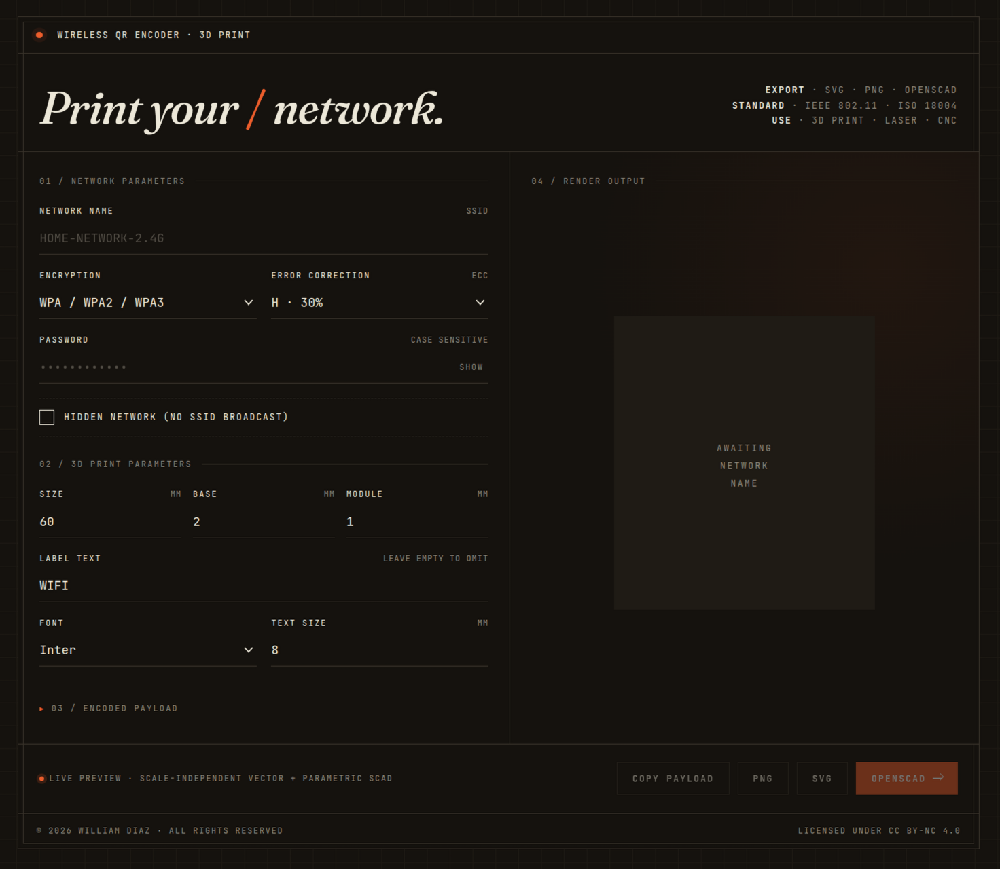

# WiFi QR Generator

> *Print your network.*

Generate scannable WiFi QR codes with a wifi icon overlay. Exports as SVG, PNG, or parametric OpenSCAD ready for 3D printing.

**[Live demo →]([https://example.com](https://wdiazux.github.io/wifi-qr-generator/))**



## What it does

You enter your WiFi credentials, you get a QR code. Any modern phone camera scans it and joins the network without typing a password.


## Features

- Standard WiFi QR format (`WIFI:T:WPA;S:...;P:...;H:false;;`) — works with iOS, Android, and any camera app
- Live preview as you type
- WPA / WPA2 / WPA3 / WEP / open networks, hidden SSID supported
- Adjustable error correction (L / M / Q / H) — H handles up to 30% damage
- Custom label below the QR with font and size controls
- Three exports — PNG (bitmap), SVG (vector), OpenSCAD (3D)
- Pure HTML / CSS / JS — no build step, no framework, no npm

## Output formats

| Format | Use it for |
|--------|-----------|
| **PNG** | Print on paper, post on a fridge, embed in a doc, share online |
| **SVG** | Laser cutting, vinyl cutting, editing in Inkscape or Illustrator |
| **OpenSCAD** | 3D printing — adjustable parameters, parametric geometry, multi-color ready |

## 3D printing

The OpenSCAD export is a parametric file with named variables you can tweak in OpenSCAD's Customizer panel:

```scad
qr_size    = 60;          // QR width × height (mm)
base_t     = 2;           // Base plate thickness (mm)
module_h   = 1;           // Raised QR module height (mm)
text_size  = 8;           // Label font size (mm)
text_font  = "Inter:style=Bold";  // Must be installed on your system
label_text = "WIFI";      // "" to omit the label entirely
```

Printing workflow:

1. Open the `.scad` file in OpenSCAD
2. Press **F6** to render (don't export from F5 preview — it's not manifold)
3. **File → Export → Export as STL**
4. Slice at 0.2 mm layer height on a 0.4 mm nozzle — no supports needed

For two-color prints (white base, black QR + icon + label), comment one of the `color()` blocks at the bottom of the SCAD file and export each layer as a separate STL.

A note on fonts: OpenSCAD only renders fonts installed on your local system. **Liberation Sans** ships with OpenSCAD on every platform and is the safe default. Inter, Roboto, Ubuntu, and Arial work if you have them installed.


## Built with

- [qrcode-generator](https://github.com/kazuhikoarase/qrcode-generator) — QR encoding
- [Font Awesome](https://fontawesome.com/) — wifi icon (CC BY 4.0)
- [Inter](https://rsms.me/inter/), [Fraunces](https://fonts.google.com/specimen/Fraunces), [JetBrains Mono](https://www.jetbrains.com/lp/mono/) — typography

No framework, no bundler, no Node — just three files (`index.html`, `style.css`, `script.js`) and two CDN dependencies.

## License

[CC BY-NC 4.0](https://creativecommons.org/licenses/by-nc/4.0/) — free to use, modify, and share with attribution. Commercial use is not permitted.

The Font Awesome wifi icon is used under its own [CC BY 4.0](https://fontawesome.com/license/free) license.

## Author

Built by [William Diaz](https://wdiaz.org).
